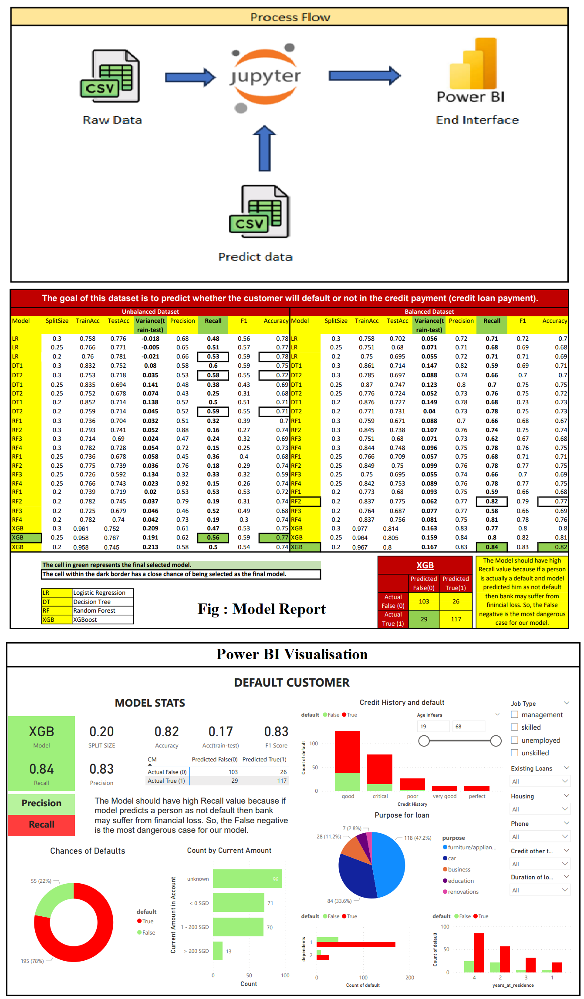

# Data Product for Singapore Based Bank Dataset

## Overview

In this project, I have created a data product that revolves around the credit landscape dataset of a large Singapore bank. The primary focus is on integrating diverse aspects of Data Analytics, Statistics, and Machine Learning to derive meaningful insights and predictions related to credit payment default.

## Technical Deliverables Completed

### Objective-1: Model Exploration

- Imported the "Raw_Data_Singapore Credit Dataset" file.
- Applied various supervised ML models with split ratios of 30%, 25%, and 20%.

### Objective-2: Model Selection and Justification

- Conducted a comparative analysis of the models.
- Finalized the Go-To model for the project based on evaluation parameters.
- Fitted the chosen model to the test dataset.
- Justified the model selection with emphasis on the selected evaluation parameter.
- Preserved the finalized model as a reference for future use.

### Objective-3: Prediction on Production Data

- Utilized the finalized model from Objective-2.
- Predicted the target label for the "Predict_Data_Singapore Credit Dataset" file.
- Appended the predicted target label to create the Viz dataset for visualization purposes.

### Objective-4: Visualization in Power BI

- Imported the Viz dataset into Power BI.
- Created visualizations for the final client output, including:
  - The name of the ML Model
  - Evaluation Metrics
  - Test-Train split value
  - Visual representation of the proportion of classes
  - Visuals illustrating the distribution of features, providing a visual understanding of which set of attributes leads to a particular class when a specific segment of the classes is selected.

For detailed code and implementation, please refer to the project repository.

## Dataset

The dataset contains comprehensive information about the credit loans provided to customers by the bank. It encompasses various features such as checking balance, loan duration, credit history, purpose, amount, savings balance, employment duration, percent of income, years at residence, age, other credit, housing type, existing loans count, job type, dependents, and phone status.

## Goals

The main goals of the data product include:

1. **Prediction of Default:** Utilize machine learning techniques to predict whether a customer is likely to default on credit payments.

2. **Insights Generation:** Conduct in-depth data analytics and statistical analysis to extract valuable insights into the credit landscape.

3. **Feature Importance:** Determine the most influential features affecting credit default and provide recommendations based on the analysis.

## Methodology

The project follows a structured methodology that involves:

- **Data Exploration:** Understand the dataset by exploring its features, distributions, and relationships.

- **Data Preprocessing:** Cleanse and preprocess the data to ensure its suitability for analysis and modeling.

- **Descriptive Statistics:** Use statistical measures to describe and summarize key aspects of the dataset.

- **Machine Learning Modeling:** Employ machine learning algorithms for predicting credit default, evaluating model performance, and identifying key predictors.

## Technologies Used

- **Programming Language:** Python
- **Tool:** Power BI
- **Libraries:** Pandas, NumPy, Matplotlib, Seaborn, Scikit-Learn
- **Machine Learning Models:** Decision Trees, Random Forest, Logistic Regression, XGBoost

## Results

The data product provides actionable insights and a predictive model for credit default. It aims to assist the bank in making informed decisions, managing risks, and improving overall credit portfolio performance.

## Future Enhancements

Future enhancements to the data product may include:

- **Model Tuning:** Fine-tuning machine learning models for improved accuracy and robustness.

- **External Data Integration:** Incorporating external data sources to enhance the predictive power of the models.

Feel free to explore the project repository for detailed code, notebooks, and documentation.

*Note: Ensure compliance with data privacy and ethical considerations throughout the project.*
